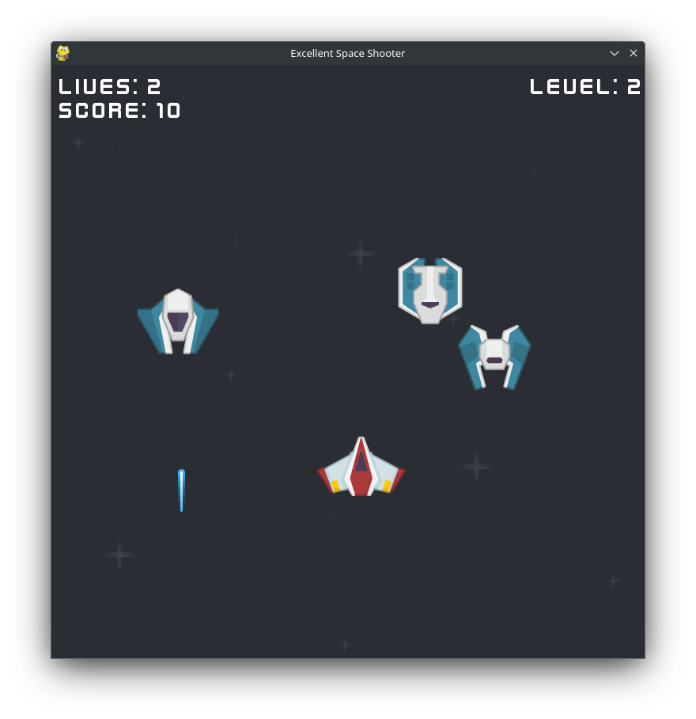

# Makwa-s Space Shooter



## Description

This is a simple 2D space shooter created using the Pygame library in Python.
The objective of the game is to survive as long as possible and defeat as many enemies as possible.

## System Requirements

To run the game, you will need Python 3 and the Pygame library installed.
If you don't have Pygame installed, you can install it using pip:
```bash
pip3 install pygame
```

## How to Play

To start the game, run the main.py file.
Use the arrow keys or WASD to move your ship and the space to fire your laser.
Avoid enemy fire and increase your score.

THANKS!!